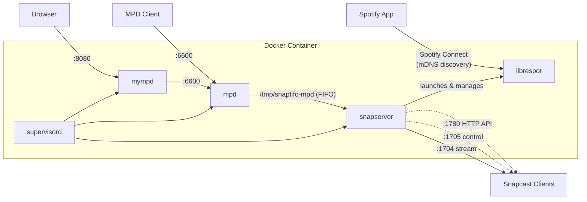

# Docker Multiroom Audio

A Docker container running [Snapcast](https://github.com/badaix/snapcast),
[librespot](https://github.com/librespot-org/librespot),
[MPD](https://www.musicpd.org/), and
[myMPD](https://github.com/jcorporation/myMPD) for multiroom audio streaming.

## Architecture



Snapserver manages librespot as a child process via its built-in `librespot://`
source type. MPD outputs audio to a named FIFO pipe that snapserver reads as a
second source. [myMPD](https://github.com/jcorporation/myMPD) provides a
web-based UI for controlling MPD (browse library, manage playlists, control
playback) on port 8080. Snapcast clients on the network connect to the server
and play the audio in sync.

## Quick Start

```bash
# Create data directories
mkdir -p mpd/music mpd/playlists mpd/data snapserver librespot-cache mympd

# Configure environment (network settings, UID/GID)
cp .env.example .env
# Edit .env to match your LAN and user setup

# Edit snapserver.conf: set 'host' to your container's IP address
docker compose up
```

The container uses an **ipvlan** network so it gets its own LAN IP address.
This allows librespot's mDNS (Zeroconf) to advertise the Spotify Connect
device on your local network. Edit `docker-compose.yml` to match your LAN
subnet, gateway, and interface.

## Configuration

### docker-compose.yml

The `user` field controls which UID:GID the container processes run as. Set
this to match your host user so that bind-mounted files have correct ownership:

```yaml
user: "1000:1000"  # Replace with your UID:GID
```

### Spotify Connect

Librespot is launched by snapserver and advertises itself as a Spotify Connect
device named **"Snapcast"**. Open Spotify on any device on the same network and
it should appear as an available device.

To change the device name, edit `snapserver.conf`:

```ini
source = librespot:///usr/bin/librespot?name=Spotify&devicename=MySpeaker&bitrate=320&volume=100&cache=/var/lib/librespot-cache
```

### snapserver.conf

The snapserver configuration is bind-mounted from `./snapserver.conf` into the
container. Key settings to adjust:

- **`host`** in `[http]`: Set this to the container's IP address so that
  Snapweb and clients can connect. This must match the `ipv4_address` in
  `docker-compose.yml`.
- **`devicename`** in the `librespot://` source: The Spotify Connect device
  name visible in the Spotify app.

### MPD

MPD listens on port **6600** and serves music from `./mpd/music/`. Use any MPD
client (e.g., `mpc`, `ncmpcpp`, or a mobile app) to control playback:

```bash
# Add music
cp -r /path/to/your/music ./mpd/music/

# Update MPD database
mpc update
```

### myMPD

[myMPD](https://github.com/jcorporation/myMPD) is a web-based MPD client
accessible at `http://<container-ip>:8080`. It provides a mobile-friendly
interface for browsing your music library, managing playlists, and controlling
playback.

myMPD auto-detects the MPD instance running in the same container on
`localhost:6600`. SSL is disabled (HTTP only) since the container runs on a
LAN behind ipvlan. State and configuration are persisted in `./mympd/`.

### Snapcast Clients

Snapcast clients on other machines connect to port **1704**. Install
`snapclient` on each machine and point it at this server:

```bash
snapclient -h <server-ip>
```

## Ports

| Port | Service              | Protocol |
|------|----------------------|----------|
| 1704 | Snapcast stream      | TCP      |
| 1705 | Snapcast control     | TCP      |
| 1780 | Snapcast HTTP API    | TCP      |
| 6600 | MPD control          | TCP      |
| 8080 | myMPD web interface  | TCP      |

## Volumes

All data is stored in bind mounts relative to the project directory:

| Host Path            | Container Path             | Purpose                             |
|----------------------|----------------------------|-------------------------------------|
| `./snapserver.conf`  | `/etc/snapserver.conf`     | Snapserver configuration            |
| `./mpd/`             | `/var/lib/mpd`             | Music, playlists, database, state   |
| `./snapserver/`      | `/var/lib/snapserver`      | Snapserver persistent data          |
| `./librespot-cache/` | `/var/lib/librespot-cache` | Spotify credentials and audio cache |
| `./mympd/`           | `/var/lib/mympd`           | myMPD state and configuration       |

Put your music files in `./mpd/music/`.

## Networking

The container uses an [ipvlan](https://docs.docker.com/network/drivers/ipvlan/)
network (L2 mode) so it gets its own IP address on the LAN. This allows
librespot's mDNS (Zeroconf) to broadcast Spotify Connect discovery without
`network_mode: host`.

**Why ipvlan instead of macvlan?** ipvlan shares the host's MAC address,
which works with WiFi access points. macvlan creates additional MAC addresses
that most WiFi APs reject. DHCP doesn't work well with ipvlan (same MAC = same
lease), so the container uses a static IP.

Snapserver's own mDNS is disabled (`mdns_enabled = false` in `snapserver.conf`)
to avoid a port 5353 conflict with librespot's built-in mDNS responder.

Configure the network in `docker-compose.yml`:

```yaml
networks:
  multiroom:
    driver: ipvlan
    driver_opts:
      parent: wlan0          # Your host's network interface
    ipam:
      config:
        - subnet: 192.168.0.0/24
          gateway: 192.168.0.254
          ip_range: 192.168.0.208/28  # Range for container IPs
```

The container's static IP must fall within `ip_range` and must **not** overlap
with your DHCP range. Update `host` in `snapserver.conf` to match this IP.

## License

GPLv3 -- see [LICENSE](LICENSE).
