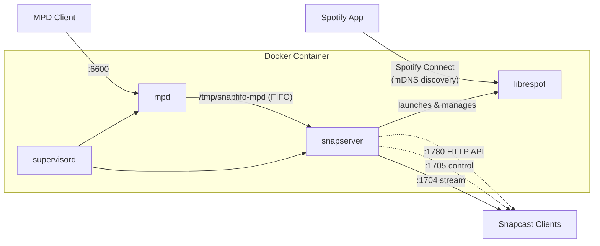

# Docker Multiroom Audio

A Docker container running [Snapcast](https://github.com/badaix/snapcast),
[librespot](https://github.com/librespot-org/librespot), and
[MPD](https://www.musicpd.org/) for multiroom audio streaming.

## Architecture



Snapserver manages librespot as a child process via its built-in `librespot://`
source type. MPD outputs audio to a named FIFO pipe that snapserver reads as a
second source. Snapcast clients on the network connect to the server and play
the audio in sync.

## Quick Start

```bash
# Create data directories
mkdir -p mpd/music mpd/playlists mpd/data snapserver librespot-cache

# Edit docker-compose.yml to set your UID:GID (see 'id -u' and 'id -g')
docker compose up
```

The container must run with `network_mode: host` so that librespot's mDNS
(Zeroconf) can advertise the Spotify Connect device on your local network.

## Configuration

### docker-compose.yml

The `user` field controls which UID:GID the container processes run as. Set
this to match your host user so that bind-mounted files have correct ownership:

```yaml
user: "1000:1000"  # Replace with your UID:GID
```

### Spotify Connect

Librespot is launched by snapserver and advertises itself as a Spotify Connect
device named **"Snapcast"**. Open Spotify on any device on the same network and
it should appear as an available device.

To change the device name, edit `snapserver.conf`:

```ini
source = librespot:///usr/bin/librespot?name=Spotify&devicename=MySpeaker&bitrate=320&volume=100&cache=/var/lib/librespot-cache
```

### MPD

MPD listens on port **6600** and serves music from `./mpd/music/`. Use any MPD
client (e.g., `mpc`, `ncmpcpp`, or a mobile app) to control playback:

```bash
# Add music
cp -r /path/to/your/music ./mpd/music/

# Update MPD database
mpc update
```

### Snapcast Clients

Snapcast clients on other machines connect to port **1704**. Install
`snapclient` on each machine and point it at this server:

```bash
snapclient -h <server-ip>
```

## Ports

| Port | Service              | Protocol |
|------|----------------------|----------|
| 1704 | Snapcast stream      | TCP      |
| 1705 | Snapcast control     | TCP      |
| 1780 | Snapcast HTTP API    | TCP      |
| 6600 | MPD control          | TCP      |

## Volumes

All data is stored in bind mounts relative to the project directory:

| Host Path          | Container Path           | Purpose                              |
|--------------------|--------------------------|--------------------------------------|
| `./mpd/`           | `/var/lib/mpd`           | Music, playlists, database, state    |
| `./snapserver/`    | `/var/lib/snapserver`    | Snapserver persistent data           |
| `./librespot-cache/` | `/var/lib/librespot-cache` | Spotify credentials and audio cache |

Put your music files in `./mpd/music/`.

## Networking

Spotify Connect discovery uses mDNS (multicast DNS) on UDP port 5353.
This requires `network_mode: host` in Docker so that multicast traffic
reaches the LAN. Standard Docker bridge networking does not support this.

Snapserver's own mDNS is disabled (`mdns_enabled = false` in `snapserver.conf`)
to avoid a port 5353 conflict with librespot's built-in mDNS responder.

If you need to run multiple instances, consider using a
[macvlan](https://docs.docker.com/network/drivers/macvlan/) network instead of
host networking -- each container gets its own LAN IP and can independently
broadcast mDNS.

## License

GPLv3 -- see [LICENSE](LICENSE).
